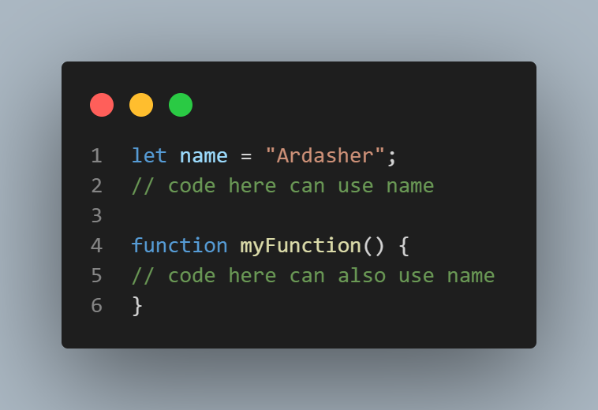
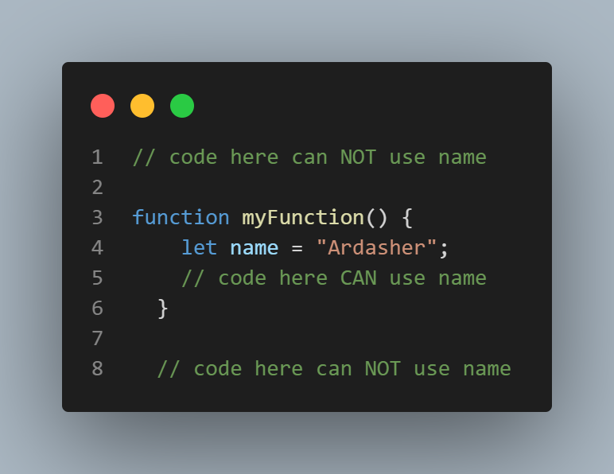
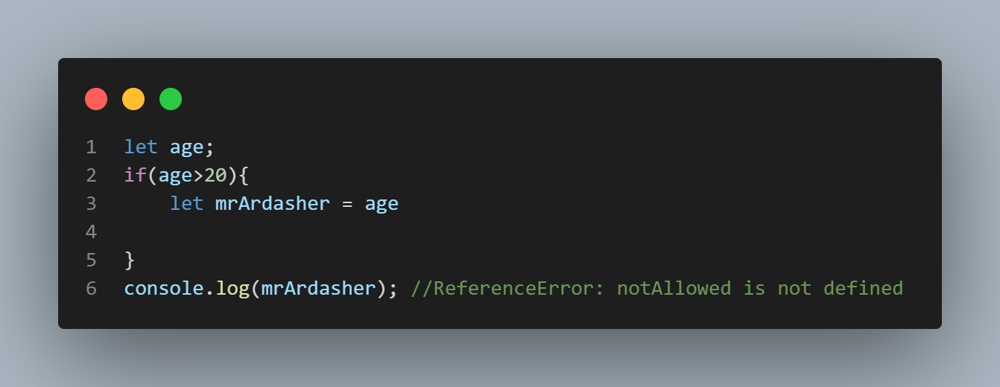
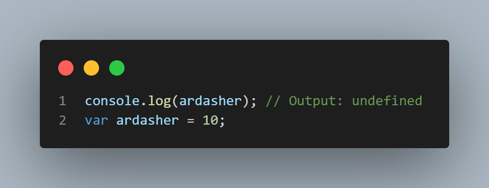
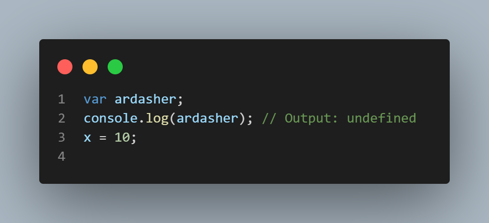
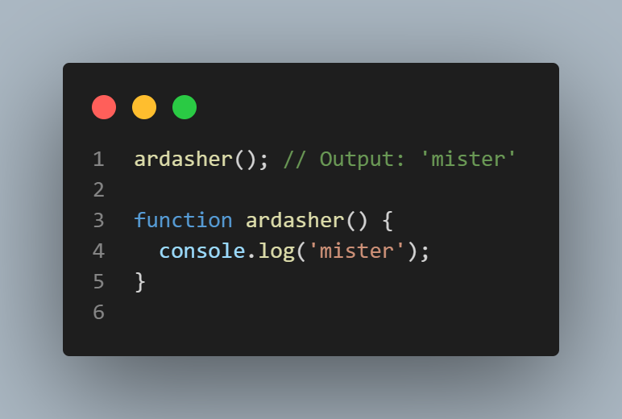
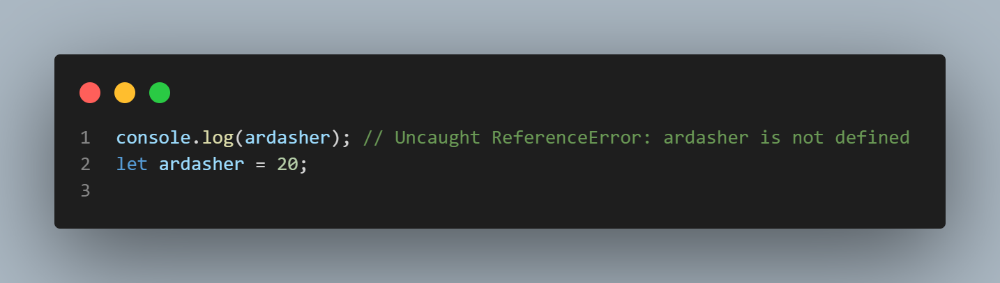
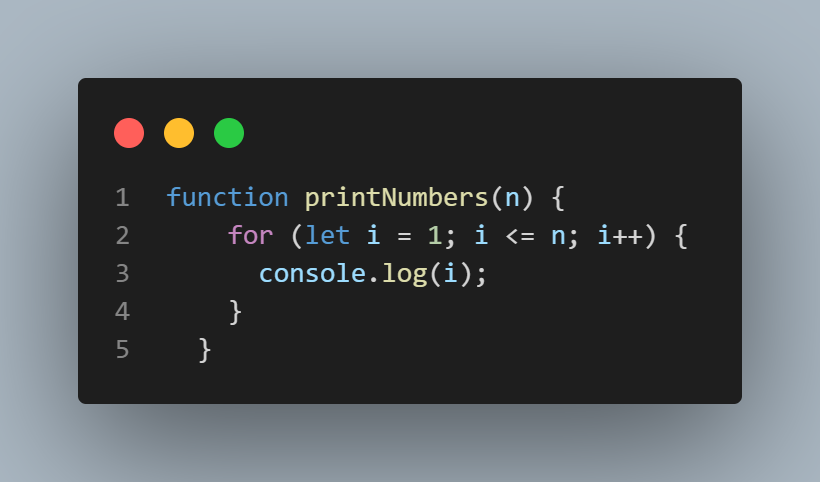
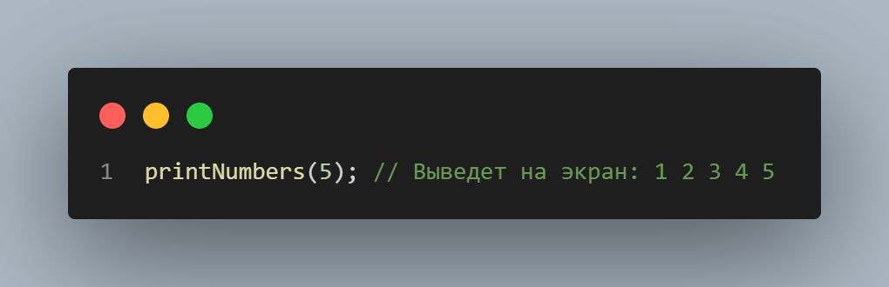
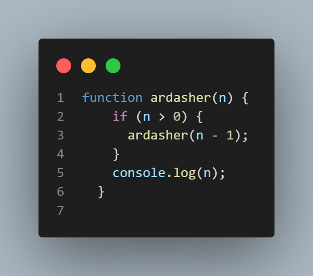

# Scope
### Что такое область видимости в Js?
 *Область видимости определяет доступность (видимость) переменных*

**JavaScript имеет 4 типа области видимости:**
**1.Global scope** - Область действия по умолчанию для всего кода

**2.Function scope** - Область действия, созданная с помощью функции

**3.Block scope** - Эта область ограничивает объявленную переменную

внутри определенного блока, от доступа снаружи блока
**4.Module scope** - Область действия кода, работающего в модульном режиме

В JavaScript модули используются для организации кода в отдельные, повторно используемые блоки. Модуль - это просто файл, содержащий JavaScript-код, который определяет одну или несколько функций, объектов или переменных, а затем экспортирует их для использования в других частях вашего приложения.

Модули позволяют инкапсулировать логику и данные в единую единицу, абстрагировать реализацию от внешнего мира. Они также помогают предотвратить конфликты имен и случайные изменения глобальных переменных, сохраняя область модуля в частном порядке.

Когда вы определяете переменную или функцию в модуле с помощью ключевых слов var, let или const, она находится в области видимости только этого модуля. Это значит, что если вы определите переменную с именем x в одном модуле и другую переменную с именем x в другом модуле, они не будут конфликтовать друг с другом, потому что они находятся в разных областях видимости.

Чтобы экспортировать переменную или функцию из модуля, вы можете использовать ключевое слово export, за которым следует имя переменной или функции:
# Hoisting in java script

**Hoisting** -  *это механизм в JavaScript, который позволяет переменным и функциям быть объявленными до их фактического определения. Это значит, что вы можете использовать переменные и функции до того, как они были объявлены.*

JavaScript имеет две фазы выполнения: компиляцию и выполнение. Во время фазы компиляции JavaScript сканирует код и находит все объявления переменных и функций. Затем он выделяет память для этих переменных и функций, но не присваивает значения переменным и не выполняет функции в этом этапе.

Во время фазы выполнения JavaScript присваивает значения переменным и выполняет функции в соответствии с порядком их вызова. В этой фазе JavaScript также учитывает область видимости переменных и функций.

При работе с переменными, объявленными с помощью ключевых слов **var** или **function**, происходит поднятие (hoisting) – это означает, что объявления перемещаются в начало текущей области видимости перед выполнением других операций.

Например, если вы используете переменную до ее объявления, то JavaScript не выдаст ошибку, а вернет значение undefined:

.

Это происходит потому, что переменная x была поднята в начало области видимости. Код выше фактически работает так:

То же самое происходит с функциями. Функции, объявленные с помощью ключевого слова function, также поднимаются в начало области видимости, поэтому вы можете вызывать функции до их определения:

Однако переменные, объявленные с помощью ключевых слов let и const, не поднимаются и не могут использоваться до своего объявления. Попытка использования переменной y до ее объявления приведет к ошибке:

Хотя hoisting может показаться удобным, его поведение может быть запутанным и привести к ошибкам. Поэтому рекомендуется всегда объявлять переменные и функции перед их использованием для ясности и предотвращения ошибок.

# Recursion

### Что такое рекурсия в JS

**Рекурсия** - это процесс, при котором функция вызывает саму себя. Это может быть полезно в тех случаях, когда нужно обработать сложные структуры данных или выполнить повторяющиеся операции.

Для того чтобы понять принцип работы рекурсии, давайте рассмотрим пример на JavaScript. Представьте, что у вас есть функция, которая выводит на экран все числа от 1 до заданного числа:

Если мы вызовем эту функцию с аргументом 5, то на экране появятся числа от 1 до 5:

Теперь давайте представим, что нам нужно вывести на экран числа от 1 до n не с помощью цикла, а с помощью рекурсивной функции. Для этого мы можем определить функцию, которая будет вызывать саму себя до тех пор, пока не достигнет базового случая. Базовый случай - это тот момент, когда функция перестает вызывать саму себя и начинает возвращать значение.

В этом коде мы сначала проверяем, что число n больше нуля. Если это условие выполнено, то мы вызываем функцию printNumbersRecursively с аргументом на единицу меньшим, чем переданный нам аргумент. Таким образом, мы продолжаем вызывать функцию до тех пор, пока n не достигнет 0. Когда это произойдет, функция начнет возвращаться из стека и выводить числа от 1 до n.

Вызов этой функции с аргументом 5 выглядел бы так:

Таким образом, мы можем использовать рекурсию в JavaScript для решения различных задач, связанных с обработкой данных. Надеюсь, эта лекция была для вас полезной!